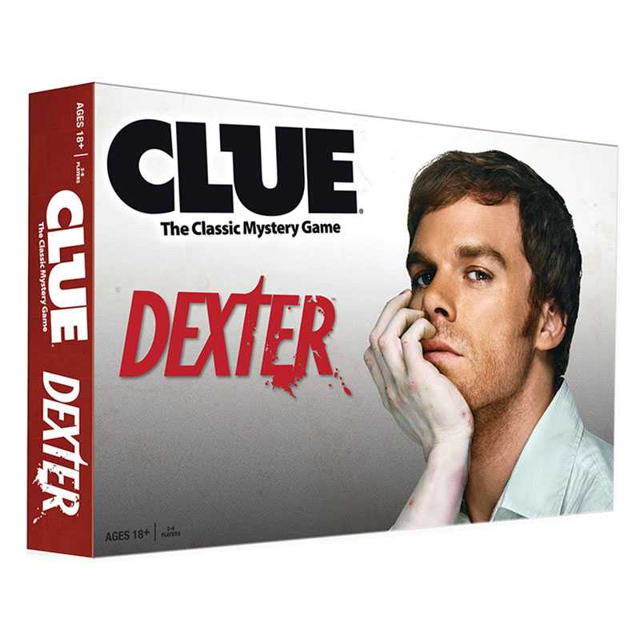
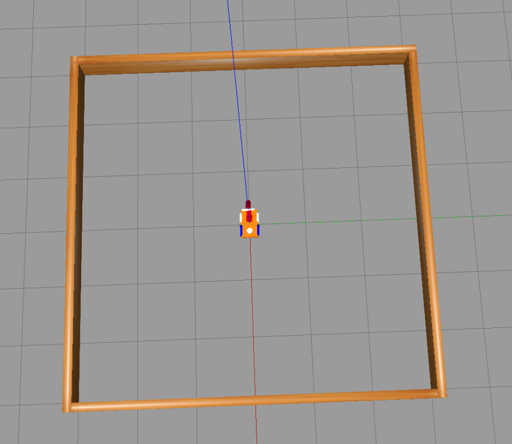
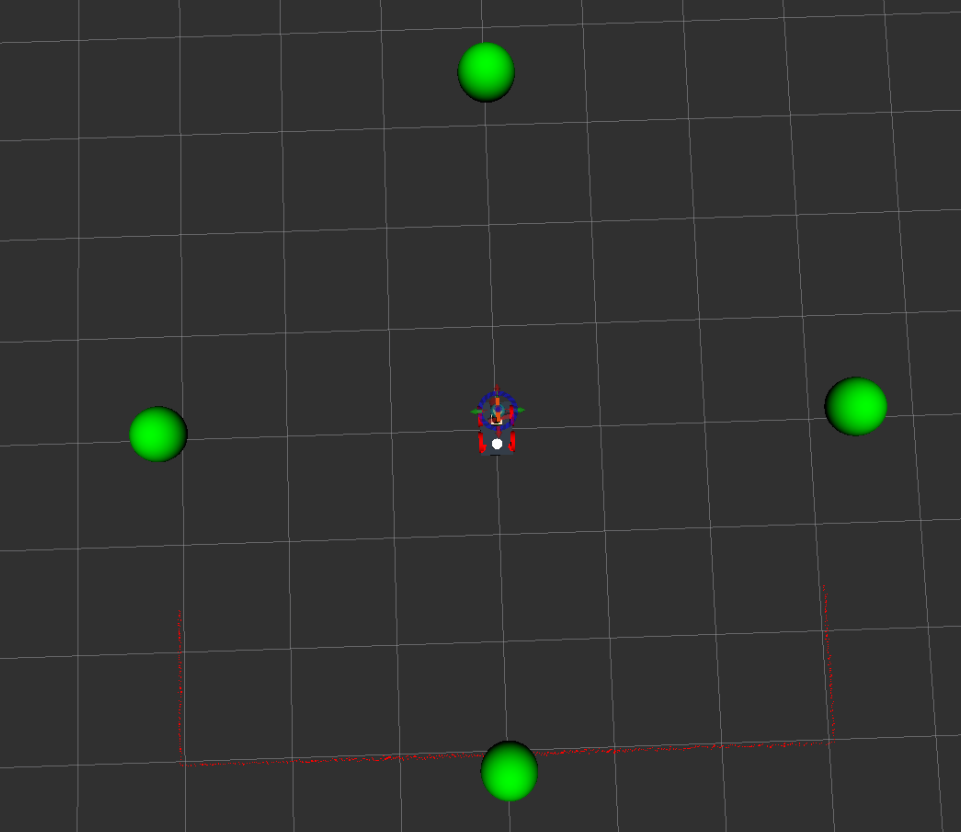

# README -- the RoboCLuedo Project -- ROUND 2

*Francesco Ganci* - S4143910 - A.A.2021/2022

---

```{toctree}
---
caption: Contents
---
./README-sphinx.md
```

---



---

## What you can find in this readme

This readme goes through the design ideas under the project. 

- expected behaviour of the project
- main design ideas
- Software Architecture components overview
- Software Architecture communication protocols overview

The parts of the architecture are deeply detailed inside this documentation, see the *Packages Documentation* section. 

## Introduction -- RCL#2

The main aim of the [RCL#2](https://github.com/programmatoroSeduto/ExperimentalRoboticsLab-Assignment-2) project is to implement the control system of a robot playing a game freely inspired to the classic board game *CLuedo*.

In particular, the system controls a 4-wheeled robot with one manipulator. The robot explores the surroundings in search of any clue that could be determinant to *understand* who is the killer, what is the weapon of the murder, and where the poor Dr. Black has been killed. The robot uses a OWL-based system to reason about the clues, collecting, putting together, and finding a one possible solution. The arbiter of the game is th so-called *Oracle*, which knows the solution, and can be interrogated when the robot is ready to announce the murderer. 

(But, differently from the real game, the robot can propose as many solution as it wants, without loosing the game after a wrong proposal...)

### Technical Goals -- RCL#2

First of all, the main aim is to create a better architecture than in the previous [RCL#1](https://github.com/programmatoroSeduto/ExperimentalRoboticsLab-Assignment-1.git) project, which is not so flexible (mainly due to unclear requirements, concerning in particular the interface of the Oracle which clearly must be external to the project): this did lead to twrow away many parts of the preivous version of the project, except for the aRMOR part which is reusable almost completely, with a little of message updates. In particular, the project should represent a basis for the third iteration of the project: the strategy is to implement an architecture which can be flexible enough to allow the re-usage of almost all the parts, with very little changes. 

Moreover, as in the other projects, a great care has been given to *the metodology of work*: not only writing the code, but also using and developing its documentation during the work. A big effort has been made as well, in documenting about the technologies involved in the implementation of this project, trying to find a way to make it work which could work also on other platforms as much as possible. Finally, the project comes with a rich *module testing* allowing to ensure the functioning of each module, either single or in combination with other elements of the architecture. See the official project documentation for further informations. 

### Features -- RCL#2

- manipulator control using MoveIt with well-known poses
- navigation using a multi-layer implementation (to gain flexibility for later updates)
- usage of a OWL-based ontology for elaborating CLuedo hints and combining them into hypotheses and then possible solutions of the mystery
- usage of a double-layered planning strategy involving a simple state-machine at high level and ROSPlan for the low-level planning
	- the project introduces a *policy* made of *landmarks*: the main idea is that the problem can be solved by "steps" (the so-called landmarks) that are macro-steps to be expanded by ROSPlan in sequences of actions to apply, depending on the situation
	- this choice allows to have a part of the architecture not taking into account the details of the PDDL model, making an *abstraction* upon the real structure of the PDDL

## Expected Behaviour -- RCL#2

Here's how the robot should behave, just as a short overview of how the RCL#2 project works. 

### ERL#2 Environment

Our RoboCLuedo starts in the middle of a little square room (6m per 6m). Here's how the environment appears on Gazebo:



Abit outside the arena, there are four markers, that in this simulation are the points where the robot can find the hints. When the robot touches a marker, it receives a hint that it can store and elaborate inside its ontology. Here's the environment as seen in RViz, showing the positions of the markers:



### Expected Behaviour

During the searching phase, there's a common sequence of operations repeated:

- go in front o a marker
- "touch" the marker (it triggers the oracle to send a hint)
- put back the robot in its home position

then the robot selects another waypoint, and the cycle restarts. When the robot succeeded in obtaining at least one CONSISTENT hypothesis, the robot goes at the center of the arena to propose its solution to the Oracle. Due to the fact that the Oracle could return a corrupted hint, or also a repeated one, the robotcould take a lot of time to formulate a acceptable hypothesis. 

## SW Arch -- Components

The project is a rich composition of many packages, resulting in a complex, heavy centralized architecture. It behaves as a classical hyerarchical architecture: sense, then plan, then act. *So far, the 'sense' part is simulated by the Oracle sending the hints*: in afuture development, the robot should get the hints from the environment using a vision system. 

### highlights of the architecture

Here are the concept I used during each phase of the job:

- **separation** : Great care has been given in *guaranteeing the neat separation between components* 
	
	for instance, the RCL ROSPlan package doesn't interact directly with the motion controllers: it exposes a client to implement instead, which is called each time a ROSPlan action needs to perform the navigation. It requires a *bridge node*, that is a delegate between the ROSPlan framework and the real navigation system. 

- **abstraction** : the interfaces provided by each package *aims at hiding the implementation details*, enhancing a standard, intuitive way to use each package
	
	in particular, most of them provide a number of *directives*, i.e. spcecific operations an external node expects to be implemented in a way that the node don't want to know. The aRMOR package along with this project is a good example of this. 

- **flexibility and adaptability** : the neat separation between packages, alongside with the abstraction, lets the architecture to be more flexible and easily updatable. 

- **module testing** : it is a fundamental concept traversing all the lifecycle of this project since RCL#1
	
	The project contains a rich module testing section, allowing the developer to not wasting time in looking for bugs in a very complex, demanding architecture. Each package can be tested independently, and most of the times with just a bash script. Sometimes also some code has been provided in order to test the project.
	
	*Developing a rich debug system is a necessity* with such a large project. You cannot go on if you can't be sure at 100% that the components "at the bottom" work as expected. It helped me during the development phase hundreds of times, even revealing bugs whicc was very difficult to spot simply running the proejct.

### Components -- simplified schema

It highlights the centralized structure of the architecture. Each component here corresponds to a package used by the project. 

The mission manager contains the bridges above-mentioned (there are bridges for both the navigation and the manipulation), as well as the *main node* providing a high-layer planning by means of landmarks and aRMOR operations. 

```{uml}
@startuml

''' INFOS
title Project Architecture simplified
skinparam Padding 10
allow_mixing


''' COMPONENTS
database "aRMOR" as ARMOR
component "MoveIt!" as MOVEIT
component "erl2 Oracle" as ORACLE
component "ROSPlan" as ROSPLAN

component "RCL environment" as ENVIRONMENT

package RCL {
node "RCL mission manager" as MISSION_MANAGER
' component "RCL Vision" as VISION
component "RCL aRMOR interface" as RCL_ARMOR
component "RCL ROSPlan" as RCL_ROSPLAN
component "RCL Movement Controller" as MOVEMENT
}


''' CONNECTIONS
ENVIRONMENT <--> MOVEIT
MOVEIT <--> MOVEMENT

ENVIRONMENT <--> MOVEMENT
MOVEMENT <--> MISSION_MANAGER

MISSION_MANAGER <--> RCL_ROSPLAN
ROSPLAN <-up-> RCL_ROSPLAN
MISSION_MANAGER <--> RCL_ARMOR
ARMOR <-right-> RCL_ARMOR
' MISSION_MANAGER <--> VISION
' VISION <--> ORACLE
MISSION_MANAGER -right- ORACLE

@enduml
```

---

### Components -- extended schema 

This schema wants to give an idea of how much the architecture of the project is extended. Inside it there are pointed out many ideas inside RCL#2:

- the ROSPlan side is a sort of mikrokosmos of components. The system uses the idea of *landmarks*, implementing the "low level planning system". See the official documentation, and in particular the design of the PDDL, for further details about such a planning policy. 
	
	The problem solution strategy is divided into three "steps", called *landmakrs* in the terminology of the project:
	
	- **REPLAN** : tidy the rosplan kb up, maing it ready for a new iteration of the strategy
	- **COLLECT** : move the robot in the environment, *using a topological localisation* integrated with the ROSPlan PDDL model
	- **SOLVE** : the final step, introduce the "assumed" solution of the case and check it; the robot moves towards the center before introducing the solution

- the movement controller package implements both the navigation system and the manipulation system. 
	
	the navigation system is divided into many layers (hierarchical architecture inside): the behavioural section, containing 
	
	- the *elementary behaviours* directly influencing the motion of the robot, 
	- combined into *composite behaviours* which group the elementary behaviours to make more structured motion strategies
	- and the *motion controllers*, components of the navigation manager (implemented as classes inside that node) providing a "cozy" abstraction for the navigation system: a external node sees onl a simple interface, without having the need to deal with the details of the implementation of the navigation system.

Here's the diagram:

```{uml}
@startuml

''' INFOS
title Project Architecture - extended
left to right direction


''' COMPONENTS
package armor{
database "aRMOR" as ARMOR
component "RCL aRMOR interface" as RCL_ARMOR
}

package "RCL Mission Manager"{
component "RCL mission manager" as MISSION_MANAGER
component "RCL manipulation unit" as MANIP_UNIT
component "RCL navigation unit" as NAV_UNIT
}

package "RCL ROSPlan" {
component "ROSPlan pipeline manager" as ROSPLAN
component "RCL kb_tools" as RCL_KBTOOLS
database "ROSPlan kb" as ROSPLANKB
component "ROSPlan components" as ROSPLAN_COMPONENTS
file "domain" as DOMAIN
file "problem" as PROBLEM
node "feedback manager" as FEEDBACK
package "RCL ROSPlan Actions" as ROSPLAN_ACTIONS {
node REPLAN
node SOLVE
node COLLECT
}
}

package "erl2"{
component "erl2 Oracle" as ORACLE
}

package "Simulated Environment" as ENVIRONMENT {
component "RCL robot"
node "Gazebo"
node "RViz"
}

package moveit {
component "MoveIt!" as MOVEIT
}

package "RCL Movement Controller" {
component "RCL navigation manager" as MOVEMENT
component "RCL manipulation controller" as MANIPULATION

package behaviours {
node "bug_m"
node "head_orientation"
node "go_to_point"
}

}

''' CONNECTIONS
ENVIRONMENT -- MOVEIT
MOVEIT -- MANIPULATION

ENVIRONMENT -- MOVEMENT

MANIPULATION -- MANIP_UNIT
MOVEMENT -- NAV_UNIT

MISSION_MANAGER -- RCL_ARMOR
RCL_ARMOR <--> ARMOR

MISSION_MANAGER -- ROSPLAN

MISSION_MANAGER -- ORACLE

PROBLEM -- ROSPLANKB
DOMAIN -- ROSPLANKB
ROSPLANKB -- ROSPLAN_COMPONENTS
ROSPLAN_COMPONENTS -- ROSPLAN 
ROSPLAN_COMPONENTS --ROSPLAN_ACTIONS
ROSPLAN_ACTIONS -- FEEDBACK
FEEDBACK -- ROSPLAN
ROSPLANKB -- RCL_KBTOOLS
RCL_KBTOOLS -- ROSPLAN

ROSPLAN_ACTIONS -- NAV_UNIT
ROSPLAN_ACTIONS -- MANIP_UNIT

@enduml
```

---

## SW Arch -- communication protocols overview

Here are the temporal diagrams of the project, describing just the essential steps performed in communicating between packages

### Foreword -- diagrams conventions

- the *package temporal diagram* represents how different independe packages work together
- the *node temporal diagram* is more specific and goes deeper into how the nodes communicate each other
- the square note is used for exposing scenarios and hypotheses
- the rhomboid annotation underlines an operation inside the node or the package

### navigation using bug_m (RCL#2)

**package temporal diagram**. The RCL#2 uses simple behaviours in order to perform the navigation. The package *robocluedo_mission_manager* offers delegates to enable the communicaton between two different packages: RCL ROSPlan, and the movement controller package.

```{uml}
@startuml

title bug_m navigation - package temporal diagram

''' ENTITIES 
collections ROSPLAN
collections MISSION
collections MOVEMENT

''' SEQUENCE
' == section ==
' ...
== First setup (first request) ==

MISSION -> MOVEMENT : SET controller <b>ID=0</b>
MISSION <- MOVEMENT : <i>success</i>
hnote over MISSION: waiting for markers

== Movement ==

ROSPLAN -> MISSION : request from ROSPlan action
MISSION -> MOVEMENT : navigation request
hnote over MOVEMENT 
performing navigation 
with BUG_M behaviour
end hnote
MISSION <- MOVEMENT : target reached
ROSPLAN <- MISSION : navigation ended

@enduml
```

**node temporal diagram**. The navigation is divided into many layers: the delegate (NAVIGATION_UNIT) inside the *robocluedo_mission_manager* package, the manager (NAVIGATION_MANAGER), the controller (NAVIGATION_CONTROLLER), the composite behaviour (BUGM_NAV) and the elementary behaviours (in this case HEAD_ORIENTATION and GOTO_POINT). 

The robot moves backwards very slowly, trying to gain space for then performing the rotation. Successively, it rotates orienting its head towards the target. The trasvel proceeds along a straight line from the starting point to the target one. And finally, the robot orients itself to reach the final pose. 

```{uml}
@startuml

title bug_m navigation - node temporal diagram
' header ...
' footer ...

''' ENTITIES 
participant MOVE_TO order 0
participant NAVIGATION_UNIT order 1
participant NAVIGATION_MANAGER order 2
participant NAVIGATION_CONTROLLER order 3
participant BUGM_NAV order 5
participant HEAD_ORIENT order 6
participant GOTO_POINT order 5

''' SEQUENCE
' == section ==
' ...

== request ==
MOVE_TO -> NAVIGATION_UNIT : using RCL ROSPlan interface
hnote over NAVIGATION_UNIT 
	waiting for markers
end hnote
NAVIGATION_UNIT -> NAVIGATION_MANAGER : using RCL navigation req
note over NAVIGATION_MANAGER
	let's assume a controller 
	has been activated before...
	otherwise, the service returns 
	immediately
end note
NAVIGATION_MANAGER --> NAVIGATION_CONTROLLER : call function


== navigation job ==
NAVIGATION_CONTROLLER -> BUGM_NAV : switch ON
hnote over NAVIGATION_CONTROLLER
	waiting for a signal ...
end hnote
note over BUGM_NAV
	the behaviour receives 
	a final orientation to achieve
	and a target to reach
end note

note over BUGM_NAV
here the BUGM_NAV Could 
perform a backwards movement
for gaining manouver space
end note

BUGM_NAV -> GOTO_POINT : switch ON

hnote over BUGM_NAV
	reading position error ...
end hnote

hnote over GOTO_POINT
turning 
towards the target ...
end hnote

hnote over GOTO_POINT
navigating straight 
to the target
end hnote

BUGM_NAV -> GOTO_POINT : switch OFF

BUGM_NAV -> HEAD_ORIENT : switch ON

hnote over BUGM_NAV
	reading orientation error ...
end hnote

hnote over HEAD_ORIENT
	turning
end hnote

BUGM_NAV -> HEAD_ORIENT : switch OFF

NAVIGATION_CONTROLLER <- BUGM_NAV : send signal
NAVIGATION_CONTROLLER -> BUGM_NAV : switch OFF

== response ==
NAVIGATION_MANAGER <-- NAVIGATION_CONTROLLER : return
NAVIGATION_UNIT <- NAVIGATION_MANAGER : response (RCL movement controller)
MOVE_TO <- NAVIGATION_UNIT : response (RCL ROSPlan)

@enduml
```

### manipulation -- synchronous manipulation

```{uml}
@startuml

title Synchronous manipulation -- RCL#2

''' ENTITIES
participant COLLECT
participant MANIP_UNIT
participant MANIPULATION

== put near to the marker ==

COLLECT --> MANIP_UNIT : send command near
MANIP_UNIT --> MANIPULATION : convert and pass request
hnote over MANIPULATION : moveit move()
MANIP_UNIT <-- MANIPULATION : <i>success</i>
COLLECT <-- MANIP_UNIT : <i>success</i>

== home position ==

COLLECT --> MANIP_UNIT : send command home
MANIP_UNIT --> MANIPULATION : convert and pass request
hnote over MANIPULATION : moveit move()
MANIP_UNIT <-- MANIPULATION : <i>success</i>
COLLECT <-- MANIP_UNIT : <i>success</i>

@enduml
```

## Mission manager workflow

Here's the state diagram of the mission manager. Please take into account that the states REPLAN, COLLECT, and SOLVE, are *landmarks*; see the documentation about the *robocluedo_rosplan* package for further informations. 

The diagram doesn't show the status FAULT_COUNT which, as the name suggests, counts the unexpected (and unexplained) failures. The node has a counter of failures, and when the counter reaches zero, the node closes wuthout succeeding the mission. This strategy *could be replaced, or altered, in future updates.*

```{uml}
@startuml

state REPLAN
REPLAN : clean the kb

state COLLECT
COLLECT : move the robot and \n collect hints around

state ASK_ORACLE
ASK_ORACLE : check if in the ontology \n there are valid hypotheses \n to propose to the Oracle

state SOLVE
SOLVE : move to the center\n ready to introduce \n a solution

state ASK_ONTOLOGY
ASK_ONTOLOGY : check the solution\nask to the Oracle

''' state MISSION_STATUS_COUNT_FAULT
''' MISSION_STATUS_COUNT_FAULT : unexpected situation

[*] --> REPLAN : mission manager begins (like Batman...)
REPLAN --> COLLECT : still mumbleing
COLLECT --> ASK_ONTOLOGY : arrived at the waypoint
ASK_ONTOLOGY --> COLLECT : no bright ideas
COLLECT --> REPLAN : end of the explorable waypoints!
ASK_ONTOLOGY --> SOLVE : at least one possible solution found
SOLVE --> REPLAN : need for updating the paths
REPLAN --> SOLVE : possible solution ready
SOLVE --> ASK_ORACLE : at the center
ASK_ORACLE --> [*] : mystery solved!
ASK_ORACLE --> REPLAN : solution wrong

@enduml
```

## ROSPlan landmarks -- temporal diagrams

The mission manager makes a high level planning, whereas the RCL ROSPlan framework performs a *mid-level planning*: the mission manager divides the mission into a *policy* made of some macro-steps, and the ROSPlan package decides how to perform such macrosteps expanding them in a sequence of actions according to the situation registered in the ROSPlan knowledge base.

This leads to a more elaborated architecture for this framework, but also makes more flexible the behaviour of the system. 

The following diagrams shows not only what happens when a landmark is requested, but also how the MISSION_MANAGER carries out the ellaboration of the landmarks. 

### REPLAN landmark

```{uml}
@startuml

title landmark execution - REPLAN

''' ENTITIES
participant MISSION_MANAGER
participant PIPELINE
participant KB_INTERFACE
participant LOAD
participant PLAN
participant PARSE
participant DISPATCH

'' TEMPORAL DIAGRAM
== planning phase ==

note over MISSION_MANAGER: try to load and solve the problem

MISSION_MANAGER -> PIPELINE : load (landmark REPLAN) and solve

PIPELINE -> KB_INTERFACE : prepare REPLAN
PIPELINE <- KB_INTERFACE : <i>always success</i>

PIPELINE -> LOAD : trigger loading
PIPELINE <- LOAD : <i>success</i> (immediately)
hnote over PIPELINE: waiting 'load' output
PIPELINE <- LOAD : 'load' output

note over PIPELINE
let's assume that everything went fine
end note

PIPELINE -> PLAN : solve the problem
PIPELINE <- PLAN : <i>success</i> (immediately)
hnote over PIPELINE: waiting 'solve' output
PIPELINE <- PLAN : 'solve' output

note over PIPELINE
let's assume that everything went fine
end note

MISSION_MANAGER <- PIPELINE : <i>success</i>

== dispatch phase ==

MISSION_MANAGER -> PIPELINE : parse and dispatch

PIPELINE -> PARSE : parse plan
PIPELINE <- PARSE
hnote over PIPELINE: waiting 'parse' output
PIPELINE <- PARSE : 'parse'

PIPELINE -> DISPATCH : dispatch plan
note over MISSION_MANAGER, DISPATCH : it requires a lot of time: the system is running the RCL ROSPlan actions
PIPELINE <- DISPATCH : end execution

MISSION_MANAGER <- PIPELINE : <i>success</i>

@enduml
```

### About COLLECT and SOLVE landmarks

the procedure is always the same for the other landmarks: the mission manager splits the landmark execution in two phases in the same way. Obviously, if something could go wrong, the procedure would be shorter, and the MISSION_MANAGER would spend a bit to understand what went wrong. 

## working hypotheses

Few assumptions are needed, since the architecture tries to interact with general-purpose frameworks, using standard ways for interacting with the low level system. The most important assumption is that *the rules of the game are satisfied*, otherwise the behaviour of the robot is not determined. 

### About the environment

- the robot moves on a flat floor: always room can be reached by moving the roobot on the same floor (the house has only one, perfectly flat, floor)
- **environment completely free, without obstacles**, for instance a small flat arena as in this assignment
- the topology of the environment is well known, as well as the cartesian coordinates of the waypoints
	- there's a node publishing the cartesian positions of the markers
	- and the *topological map of the environment* is known in advance

### About the reasoning

- the mystery can be solved at least with a two-steps policy COLLECT, SOLVE
	- it is mostly due to the rules of the game
	- *if the game changes, the policy should be reviewed* accordingly to the new rules
	- in particular, if the problem cannot be reduced in a combination of two general steps, the planner shall provide other landmarks
- *a solution exists*
	- i.e. the oracle works fine

## Limitations

- the robot can work only in well-known environments. It doesn't support free exploration
	- the free exploration requires the robot to choose by itself the waypoints, maybe based on the measurements from the laser sensor, or other systems
	- currently, there's no such a functionality
- *no secure communication error handling*. 
	- there could be a big deal try to run the achitecture distributed on a WiFi network: when a service call fails for instance, most of the nodes of the project are not able to cope with that in a acceptable situation. Most of times the node simply closes
	- overcoming this problem requires a long work of code review and, sometimes, re-design

## Improvements and future develops

**Create a distributed version of the architecture, with multiple robots**. Thanks to the strict separation between the components applied during the design and then during the implementation, the architecture can be extended to many robots inside the same environment. Some components can be centralized, such as the part concerning the ontology. The main problem in this case could be the to find a tradeoff between the       bandwidth required to enable the robots to communicate with the central system, and the computational capabilities onboard. 

**Architectural Review of the ROSPlan package**. Currently the knowledge base interface inside the *robocluedo_rosplan* package is of no use for nodes outside. There are many situations in which having directives exposed by the knowledge base interface can be useful. For instance, the code of the pipeline manager, currently *too much complex*, can be simplified a lot distributing the capability to explain a failure on two nodes. And, finally, the capability to write inside the ontology, taking into account the characteristics of the PDDL problem, is always useful. For these reasons, the ROSPlan implementation should be reviewed in order to provide a better supporto to the working cycle. The current package can be considered a *first prototype*, and it shall be formalized from the architectural point of view, and reimplemented, taking into account also the *directives* and the *features* given the PDDL model. 

**Manipulation Controller**. The manipulation approch can be heavily reviewed. The robot currently uses a very raw implementation of a moveit-based controller using well-known poses only. The cartesian plan should be introduced. Even a end effector should be defined. 

**Navigation manager and controllers**. The current structure can be improved a lot. The current navigation manager is very near to be a prototype: the approach works quite good, even if the problem is too much simple to see any relevant advantage from the approach with navigation controllers, but it should be implemented in a more tidy way. For instance, the system shall be divided into several files, instead of a long one a bit lasagna-code style.

**URDF model improvements**. The current module, although it works quite good, it is too much basic. The physic can be improved, regulating with more attention the inertias of the components. Also the controllers can be improved. A code review on the model could help as well. 

**Adding a real graphical interface**. The project completely lacks of a decent user interface, which is, in my opinion, one of the most serious limitations of the project. The user, and the developer as well, should be enabled to understand what's wrong using a GUI instead of many prints on a console. A GUI allows to see the status of the entire project *at a glance*, instead of reading endless logs and console messages trying to grasp something. Also the image visualisation should be improved, allowing the user to select one camera to visualise, for instance. 

---


---

## Author and Contacts

A project designed and developed by Francesco Ganci (S4143910)

- **Email** : [*S4143910@studenti.unige.it*]()
